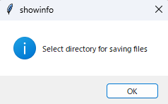

# dcimg2btf
This is a script to convert files in the dcimg format from Hamamatsu Photonics to the btf format.

The dcimg format is a format that allows for fast writing, but it cannot be loaded in programs such as Fiji. Therefore, it was necessary to convert it to the more manageable btf format, and I implemented code to directly convert dcimg format to btf format. The conversion speed has been improved with some optimizations.

## Installation

1.Clone this repository in command line.
```bash
git clone https://github.com/MonmaNobuaki/dcimg2btf.git
```

2.Go into the repository.
```bash
cd dcimg2btf
```

3.Use the package manager pip to install requirements.
```bash
pip install -r requirements.txt
```

## Usage
This script is designed to extract dcimg format files from a specified folder and convert them into btf format. Additionally, it allows for the selection of a destination folder to save the converted files. With several optimizations, the conversion process is executed at a high speed.

Please execute the script with the following command
```bash
python dcimg2btf.py
```
When you execute the script, a window will appear. Please select the folder containing the dcimg files you want to convert.


After specifying the folder you want to read from, the next step is to specify the folder where you want to save the converted files. A similar window will appear, so please select the folder you want to use for writing.



After specifying the input and output folders, please wait for the conversion to finish. This may take some time depending on the number of files and the size of the files being converted.

## Contributing
Questions are welcome. I would be glad to receive feedback from everyone.

## License
This file is open-source and available for use. I would be delighted if it could be useful to many people.
