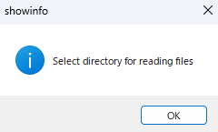

# dcimg2btf
This is a script to convert the .dcimg files to the btf format. The dcimg format is from Hamamatsu Photonics. 

The dcimg format is a format that allows for fast writing, but it cannot be loaded in programs such as Fiji. Therefore, it was necessary to convert it to the more manageable btf format, and I implemented code to directly convert dcimg format to btf format. The conversion speed has been improved with some optimizations.

## Installation

1.Clone this repository in command line.
```bash
git clone https://github.com/MonmaNobuaki/dcimg2btf.git
```

2.Go into the repository.
```bash
cd dcimg2btf
```

## Usage
This script is designed to extract dcimg format files from a specified folder and convert them into btf format. Additionally, it allows for the selection of a destination folder to save the converted files. With several optimizations, the conversion process is executed at a high speed.

Before executing,set the number of pixels in height and width of the file you want to convert in line 9 of the script. 

Please execute the script with the following command
```bash
python dcimg2btf.py
```
When you execute the script, a window will appear. Please select the folder containing the dcimg files you want to convert.



After specifying the folder you want to read from, the next step is to specify the folder where you want to save the converted files. A similar window will appear, so please select the folder you want to use for writing.


After specifying the input and output folders, please wait for the conversion to finish. This may take some time depending on the number of files and the size of the files being converted.

## Contributing
This script is open-source and available for use. But, if you have any questions, Please contact me not Hamamatsu Photonics. 

## License
Copyright 2023 Nobuaki Monma

Permission is hereby granted, free of charge, to any person obtaining a copy of this software and associated documentation files (the “Software”), to deal in the Software without restriction, including without limitation the rights to use, copy, modify, merge, publish, distribute, sublicense, and/or sell copies of the Software, and to permit persons to whom the Software is furnished to do so, subject to the following conditions:

The above copyright notice and this permission notice shall be included in all copies or substantial portions of the Software.

THE SOFTWARE IS PROVIDED “AS IS”, WITHOUT WARRANTY OF ANY KIND, EXPRESS OR IMPLIED, INCLUDING BUT NOT LIMITED TO THE WARRANTIES OF MERCHANTABILITY, FITNESS FOR A PARTICULAR PURPOSE AND NONINFRINGEMENT. IN NO EVENT SHALL THE AUTHORS OR COPYRIGHT HOLDERS BE LIABLE FOR ANY CLAIM, DAMAGES OR OTHER LIABILITY, WHETHER IN AN ACTION OF CONTRACT, TORT OR OTHERWISE, ARISING FROM, OUT OF OR IN CONNECTION WITH THE SOFTWARE OR THE USE OR OTHER DEALINGS IN THE SOFTWARE.
